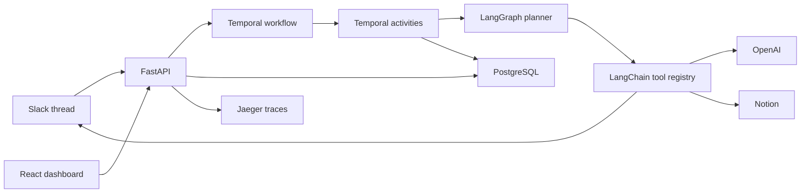

# ThreadBrief

AI Slack-thread issue brief generation through Slack, Notion, LangGraph, LangChain, Temporal, and audit trails.

ThreadBrief is a Slack-native issue documentation coordinator. It turns an active Slack thread about a bug, incident, decision, or engineering issue into a living Notion document covering the issue, root cause, proposed fixes, risks, rollback concerns, owners, decisions, and open questions.

## What ThreadBrief Is

ThreadBrief is not a generic chatbot or a passive transcript exporter. It is a durable workflow system for turning messy Slack discussion into structured engineering documentation. A Slack command or mention starts the workflow, people discuss the issue in-thread, ThreadBrief creates and updates a Notion issue brief, and the system keeps audit/provenance around the discussion and document.

## Architecture Focus

- **Temporal** coordinates long-running issue-documentation workflows with activities, signals, queries, timers, retries, and idempotent integration calls.
- **LangGraph** models the analysis agent as a structured state machine for issue extraction, root-cause analysis, fix/risk synthesis, revision, and finalization.
- **LangChain** tools are the formal plugin layer for Slack, Notion, OpenAI, export, audit, and provenance.



## Slack Workflow

Users can start a run through a mention or slash command:

```text
@Wayfinder document this issue: deploy caused API 500s for workspace users after the cache migration.
```

ThreadBrief keeps discussion in the original thread. Replies are captured as evidence, appended to the Notion brief, and used to refine sections for root cause, fixes, risks, owners, decisions, and open questions.

## Temporal Is Central

Temporal owns the durable lifecycle: workflow start, activity execution, signals for thread updates/approval/changes/cancellation, queries for dashboard state, timers for reminders, retry/idempotency boundaries, and approval waits that survive worker restarts.

To demonstrate durability, start a trip, wait until approval, stop the worker with `podman compose stop worker`, approve in the dashboard, then restart with `podman compose start worker`.

## LangGraph Agent State

LangGraph models analysis as structured state: issue summary, symptoms, evidence, suspected root causes, proposed fixes, risks, rollback plans, owners, decisions, open questions, Notion payload, Slack payload, approvals, revisions, errors, and messages.

## LangChain Tools

LangChain-style tools are the plugin layer. Every capability exposes typed Pydantic input/output schemas, risk metadata, approval behavior, idempotency policy, retry policy, integration name, and version.

## Notion Issue Briefs

ThreadBrief creates a Notion page with sections for issue, current understanding, root cause, proposed fixes, risks, open questions, decision log, Slack discussion evidence, and metadata. New Slack thread replies are appended to the brief as evidence.

## Quick Start

```bash
cp .env.example .env
make up
```

Open:

- Dashboard: http://localhost:5173
- API health: http://localhost:8000/api/health
- Temporal UI: http://localhost:8080
- Jaeger: http://localhost:16686

## Manual Demo Input Mode

When Slack credentials are unavailable, ThreadBrief supports manual demo input mode from the dashboard. This path is for local development and demonstrations; the primary product path remains real Slack, real Notion, and real OpenAI.

## Setup

- OpenAI: set `OPENAI_API_KEY` and optionally `OPENAI_MODEL`.
- Slack: set bot token, signing secret, app token, and default channel.
- Notion: set API key and parent page or database ID.
- PostgreSQL, Temporal, Temporal UI, Jaeger, API, worker, and web are provided by compose.

## Testing

```bash
make test
```

The free CI path runs Python unit tests and frontend Vitest tests. Tests use deterministic fixtures and do not call paid APIs.

## Safety

ThreadBrief does not replace incident review, security review, or human approval. Generated analysis should be reviewed by the team before being treated as final.
