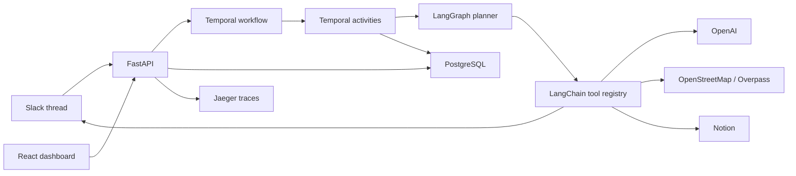

# Wayfinder

AI group trip coordination through Slack, Notion, LangGraph, LangChain, Temporal, and open travel data.

Wayfinder is a Slack-native group trip planning coordinator. It is designed as a durable, multi-user, human-in-the-loop workflow demo where Temporal owns orchestration, LangGraph owns agent state transitions, and LangChain tools own integrations.

## What Wayfinder Is

Wayfinder is not a booking app, payment flow, travel marketplace, or one-shot itinerary generator. It is a Slack-native group trip coordination agent and durable workflow demo. A Slack thread starts the workflow, multiple people reply with preferences, Wayfinder normalizes and reconciles the group state, discovers candidate places from open travel data, drafts an itinerary, creates a Notion trip document, waits for human approval, revises when asked, and records audit/provenance throughout.

## Architecture Focus

- **Temporal** coordinates long-running trip planning workflows with activities, signals, queries, timers, retries, and idempotent integration calls.
- **LangGraph** models the planning agent as a structured state machine with branching nodes for parsing, preference collection, conflict detection, place discovery, itinerary generation, revision, and finalization.
- **LangChain** tools are the formal plugin layer for OpenAI, Slack, Notion, Overpass, itinerary generation, budget estimation, export, and provenance.



## Slack Workflow

Users can start a run through a mention or slash command:

```text
@Wayfinder plan a 3-day trip to San Diego for 4 people in August. Budget around $800 each.
```

Wayfinder keeps collection in the original thread. Replies from Alex, Priya, Jordan, and Sam are stored separately, merged into group preferences, checked for conflicts, and preserved as provenance.

## Temporal Is Central

Temporal owns the durable lifecycle: workflow start, activity execution, signals for clarification/preferences/approval/changes/cancellation, queries for dashboard state, timers for reminders and auto-continue, retry/idempotency boundaries, and approval waits that survive worker restarts.

To demonstrate durability, start a trip, wait until approval, stop the worker with `podman compose stop worker`, approve in the dashboard, then restart with `podman compose start worker`.

## LangGraph Agent State

LangGraph models planning as structured state: trip basics, participant responses, per-user preferences, merged preferences, conflicts, tradeoffs, planning rules, candidate places, ranked places, itinerary, budget, Notion payload, Slack payload, approvals, revisions, errors, and messages.

## LangChain Tools

LangChain-style tools are the plugin layer. Every capability exposes typed Pydantic input/output schemas, risk metadata, approval behavior, idempotency policy, retry policy, integration name, and version.

## Open Travel Data

Wayfinder uses OpenStreetMap through Overpass by default. Optional Wikidata and Wikivoyage providers are included as disabled-by-default extension points. Open data attribution is carried into the itinerary and Notion page.

## Quick Start

```bash
cp .env.example .env
make up
```

Open:

- Dashboard: http://localhost:5173
- API health: http://localhost:8000/api/health
- Temporal UI: http://localhost:8080
- Jaeger: http://localhost:16686

## Manual Demo Input Mode

When Slack credentials are unavailable, Wayfinder supports manual demo input mode from the dashboard. This path is for local development and demonstrations; the primary product path remains real Slack, real Notion, real OpenAI, and OpenStreetMap/Overpass.

## Setup

- OpenAI: set `OPENAI_API_KEY` and optionally `OPENAI_MODEL`.
- Slack: set bot token, signing secret, app token, and default channel.
- Notion: set API key and parent page or database ID.
- PostgreSQL, Temporal, Temporal UI, Jaeger, API, worker, and web are provided by compose.

## Testing

```bash
make test
```

The free CI path runs Python unit tests and frontend Vitest tests. Tests use deterministic fixtures and do not call paid APIs.

## Safety

Wayfinder does not book travel, take payments, guarantee live prices, or guarantee current business hours. Budget estimates are approximate and users should verify reservations, transportation, and costs manually.
