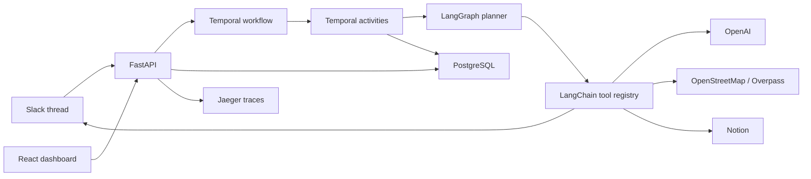

# Wayfinder

AI group trip coordination through Slack, Notion, LangGraph, LangChain, Temporal, and open travel data.

Wayfinder is a Slack-native group trip planning coordinator. It is designed as a durable, multi-user, human-in-the-loop workflow demo where Temporal owns orchestration, LangGraph owns agent state transitions, and LangChain tools own integrations.

## Current Build

This repository is being implemented in phases. Phase 1 provides the monorepo scaffold, local stack, FastAPI health API, Temporal worker shell, React dashboard shell, CI, and environment hygiene.

## Architecture Focus

- **Temporal** coordinates long-running trip planning workflows with activities, signals, queries, timers, retries, and idempotent integration calls.
- **LangGraph** models the planning agent as a structured state machine with branching nodes for parsing, preference collection, conflict detection, place discovery, itinerary generation, revision, and finalization.
- **LangChain** tools are the formal plugin layer for OpenAI, Slack, Notion, Overpass, itinerary generation, budget estimation, export, and provenance.



## Quick Start

```bash
cp .env.example .env
make up
```

Open:

- Dashboard: http://localhost:5173
- API health: http://localhost:8000/api/health
- Temporal UI: http://localhost:8080
- Jaeger: http://localhost:16686

## Manual Demo Input Mode

When Slack credentials are unavailable, Wayfinder supports manual demo input mode from the dashboard. This path is for local development and demonstrations; the primary product path remains real Slack, real Notion, real OpenAI, and OpenStreetMap/Overpass.

## Safety

Wayfinder does not book travel, take payments, guarantee live prices, or guarantee current business hours. Budget estimates are approximate and users should verify reservations, transportation, and costs manually.
